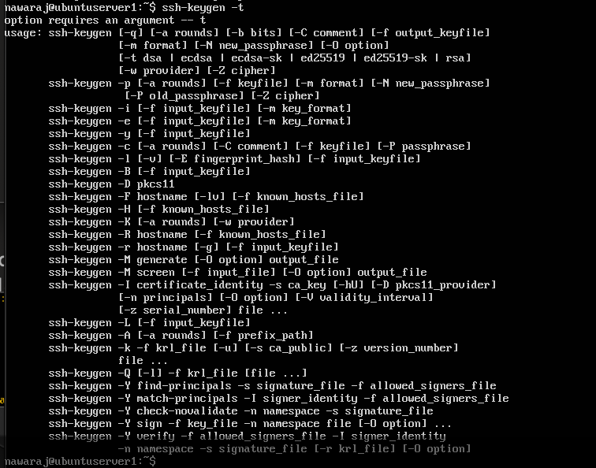
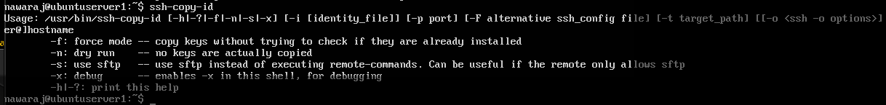
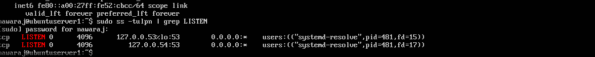
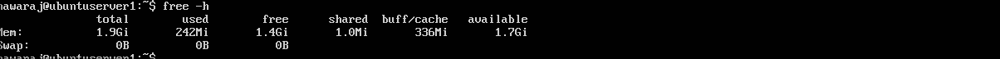
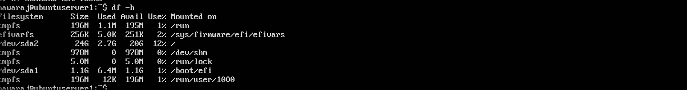
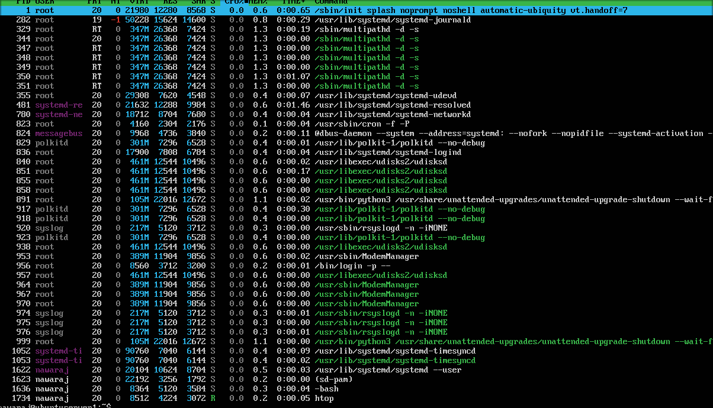
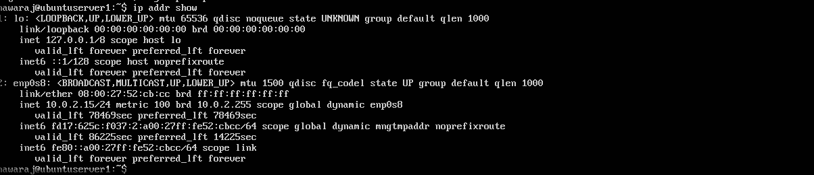
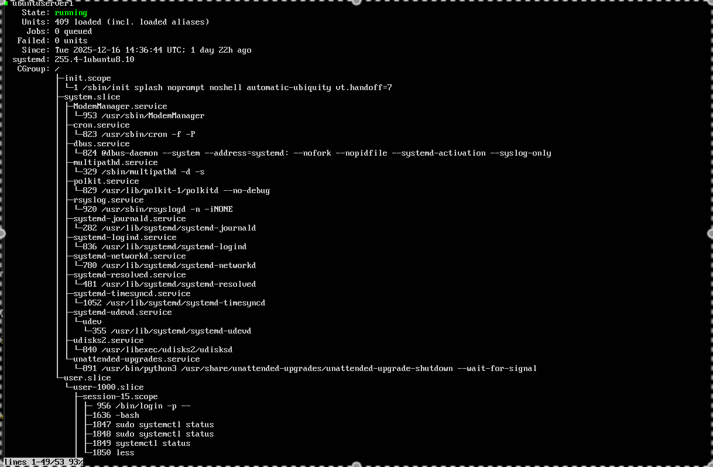
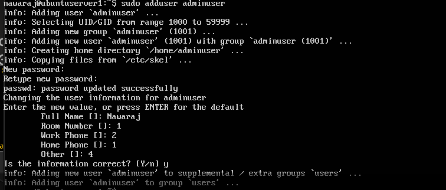

# Week 2 — Security Planning & Testing Methodology

**[← Week 1](week1.md)** | **Week 2** | **[Week 3 →](week3.md)**

---

## 📋 Overview

Week 2 focuses on **planning security controls and performance testing methodology** before making changes to the system.  
The goal is to define **what will be measured**, **how evidence will be collected**, and **which risks will be mitigated**, following a **defense-in-depth approach**.

All activities are designed for **remote administration via SSH**, ensuring the server remains headless and production-representative.

---

## 🎯 Objectives

* Design a remote performance monitoring strategy
* Define a security hardening checklist
* Establish a threat model with mitigations
* Prepare evidence collection for later implementation

---

## 📦 Deliverables

* Performance testing plan
* Security configuration checklist
* Threat model
* Screenshot-based evidence preparation

---

## 1. Performance Testing Plan

### 1.1 Remote Monitoring Methodology

* All monitoring performed remotely via SSH
* Native Linux command-line tools only
* Metrics captured at fixed intervals
* Evidence collected via terminal output screenshots

**Example command:**
```bash
ssh user@server "vmstat 5 5"
````

---

### 1.2 Planned Metrics

| Resource  | Metrics                   |
| --------- | ------------------------- |
| CPU       | Utilisation, load average |
| Memory    | Free/used RAM, swap       |
| Disk      | Capacity usage            |
| Network   | Active interfaces, ports  |
| Processes | Resource consumption      |

---

### 1.3 Monitoring Tools

```bash
top
htop
free -h
df -h
ip addr
ss -tulpn
systemctl status
```

These tools provide sufficient visibility without adding unnecessary overhead.

---

## 2. Security Configuration Checklist

### 2.1 SSH Hardening (Planned)

* Disable root login
* Disable password authentication
* Enable SSH key-based access
* Restrict allowed users
* Enforce session timeouts

---

### 2.2 Firewall Strategy (UFW)

* Default deny incoming traffic
* Allow SSH only from trusted IP
* Enable firewall logging
* Enforce allow-list model

---

### 2.3 User Privilege Management

* Non-root administrative user
* Least-privilege sudo access
* No passwordless sudo
* Regular privilege review

---

## 3. Threat Model

### Threat 1: Unauthorized SSH Access

**Risk:** High

**Mitigations**

* SSH key authentication
* Firewall IP restriction
* Service monitoring

---

### Threat 2: Privilege Escalation

**Risk:** Medium–High

**Mitigations**

* Limited sudo access
* User separation
* Audit of administrative commands

---

### Threat 3: Service Exposure

**Risk:** Medium

**Mitigations**

* Minimal services enabled
* Active port monitoring
* Controlled service management

---

## 📸 Evidence: Security & Monitoring Screenshots

> All screenshots captured remotely via SSH and stored for verification.

### SSH Key Generation



**Figure W2-1:** SSH key pair generation on the workstation.

---

### SSH Key Deployment



**Figure W2-2:** SSH public key deployed to server.

---

### Active Listening Services



**Figure W2-3:** Active services and listening ports.

---

### Memory Usage



**Figure W2-4:** Memory and swap utilisation.

---

### Disk Usage



**Figure W2-5:** Disk capacity usage.

---

### Process Monitoring



**Figure W2-6:** Real-time process and CPU monitoring.

---

### Network Configuration



**Figure W2-7:** Network interface configuration.

---

### Service Control



**Figure W2-8:** System service status verification.

---

### User & Sudo Management



**Figure W2-9:** User privileges and sudo configuration.

---

## ✅ Week 2 Summary

* Security strategy defined before implementation
* Performance metrics clearly planned
* Threats identified with practical mitigations
* Evidence collection prepared
* System ready for controlled hardening and testing

---

**[← Week 1](week1.md)** | **Week 2** | **[Week 3 →](week3.md)**


