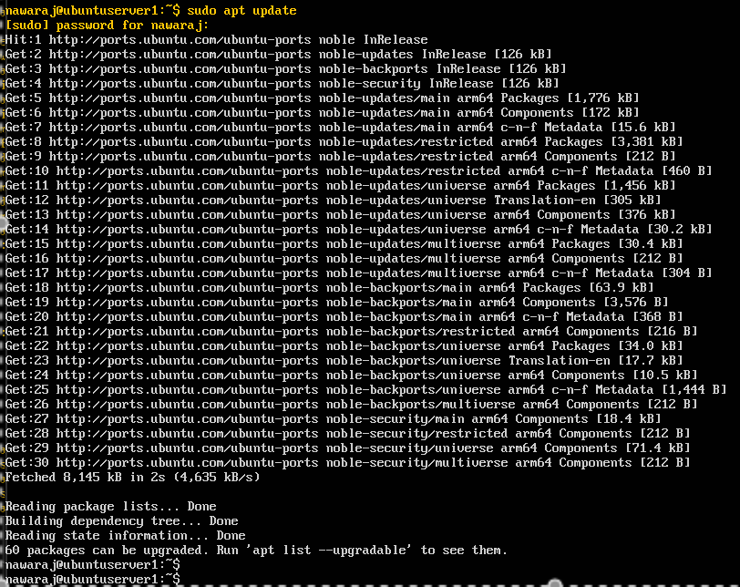
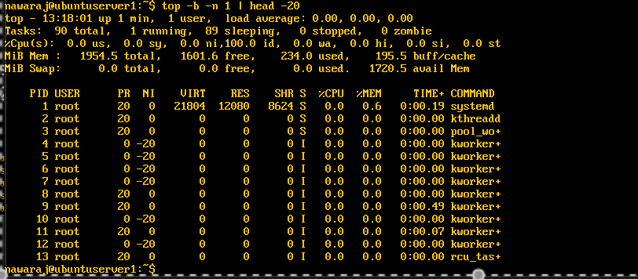
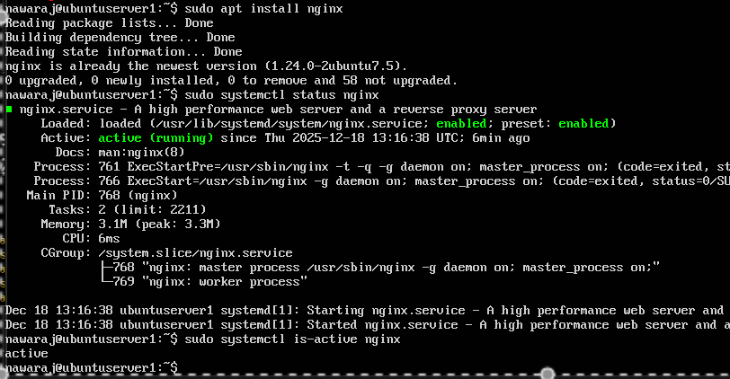

# Week 3: Application Selection for Performance Testing

**[← Week 2](week2.md)** | **Week 3** | **[Week 4 →](week4.md)**

---

## 📋 Overview

This week focuses on selecting representative applications to evaluate operating system performance under different workload categories. Each application was chosen based on how it stresses specific OS resources, including CPU scheduling, memory management, disk I/O, and network throughput.

All tools are installed and managed via SSH using command-line utilities only, ensuring a headless, lightweight, and production-representative environment.

Expected resource utilisation patterns are defined in advance to support meaningful comparison between baseline (idle) and active workload states in later weeks.

---

## 🎯 Objectives

- Select applications that stress different system resources
- Document installation commands using SSH only
- Define expected resource utilisation profiles per application
- Establish a monitoring strategy for each workload type

---

## 📦 Deliverables

- Application selection matrix
- Installation documentation
- Expected resource utilisation profiles
- Monitoring strategy

---

## 📊 Selected Workload Categories

- CPU-intensive
- Memory (RAM)-intensive
- Disk / I/O-intensive
- Network-intensive
- Server / service-based workload

---

## 🔧 Application Selection Matrix

| Workload Type | Application | Description | Justification |
|--------------|-------------|-------------|--------------|
| CPU-intensive | `stress-ng` | CPU stress testing tool | Evaluates CPU scheduling and saturation |
| RAM-intensive | `stress-ng` (vm workers) | Memory stress testing | Analyses paging and memory pressure |
| I/O-intensive | `fio` | Disk I/O testing | Measures read/write throughput and latency |
| Network-intensive | `iperf3` | Network performance testing | Measures bandwidth and throughput |
| Server workload | `nginx` | Web server | Simulates real-world service load |

---

## 💻 Installation Documentation (via SSH)

### SSH Access Verification

```bash
ssh user@192.168.56.103
````

📸 **Screenshot**
Filename: `ssh.png`


**Figure W3-1:** Successful SSH connection to the Ubuntu Server.

---

### Application Installation

```bash
sudo apt update
sudo apt install -y stress-ng fio iperf3 nginx sysstat
```

📸 **Screenshot**
Filename: `appintallation.png`



**Figure W3-2:** Installation of performance testing applications via SSH.

---

### Application Verification

```bash
stress-ng --version
fio --version
iperf3 --version
nginx -v
```

📸 **Screenshot**
Filename: `appverification.png`


**Figure W3-3:** Version output confirming successful installation.

---

## 📈 Monitoring Strategy

### Baseline Measurement (Idle)

```bash
top -bn1
free -h
vmstat 1 5
iostat -xz 5
uptime
```

Baseline measurements establish reference values for later comparison.

---

### CPU Workload Execution

```bash
stress-ng --cpu 4 --timeout 60s
```

📸 **Screenshot**
Filename: `cputimeout.png`



**Figure W3-4:** CPU utilisation during stress-ng execution.

---

### Server Application Status

```bash
systemctl status nginx
```

📸 **Screenshot**
Filename: `nginxstatus.png`



**Figure W3-5:** nginx running as a representative server workload.

---

## 📊 Expected Resource Utilisation Profiles

| Application     | CPU          | Memory       | Disk I/O      | Network   | Notes              |
| --------------- | ------------ | ------------ | ------------- | --------- | ------------------ |
| stress-ng (CPU) | Very High    | Low          | Minimal       | None      | CPU saturation     |
| stress-ng (RAM) | Moderate     | Very High    | Possible swap | None      | Memory pressure    |
| fio             | Low–Moderate | Low          | Very High     | None      | Disk performance   |
| iperf3          | Moderate     | Low          | Minimal       | Very High | Network throughput |
| nginx           | Low–Moderate | Low–Moderate | Low           | Moderate  | Real-world service |

---

## 💭 Reflection (Week 3)

This week highlighted how different applications stress specific operating system components. Selecting appropriate workloads enables precise observation of CPU, memory, disk, and network behaviour. This planning stage ensures later performance testing is measurable, repeatable, and meaningful.

---

## 📄 Next Week Preview — Week 4

* Implement SSH key-based authentication
* Configure firewall rules (UFW)
* Create non-root administrative user
* Begin secure remote administration

---

**[← Week 2](week2.md)** | **Week 3** | **[Week 4 →](week4.md)**

