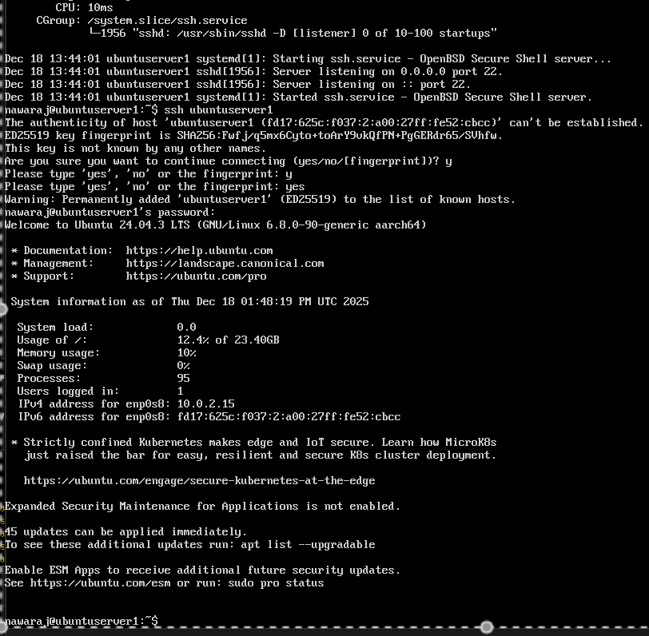
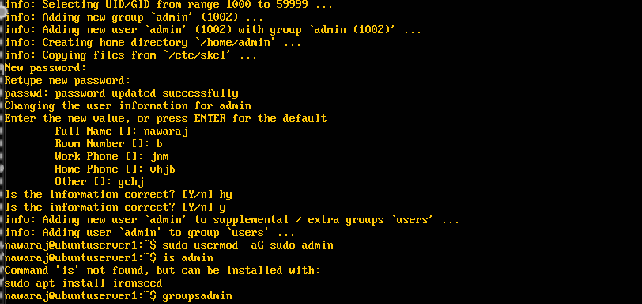
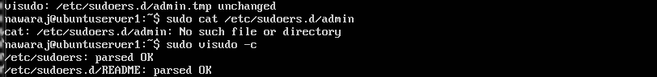

# Week 4: Initial Configuration & Security Implementation

**[← Week 3](week3.md)** | **Week 4** | **[Week 5 →](week5.md)**

---

## 📋 Overview

This week focuses on implementing core security controls planned in earlier phases. The primary goal is to harden remote access, restrict network exposure, and enforce least-privilege administration on the Ubuntu Server.

All configuration and evidence collection are performed remotely via SSH, with no local console access, to reflect real-world server administration practices.

---

## 🎯 Objectives

- Configure SSH key-based authentication and disable password login
- Restrict SSH access via firewall rules to the workstation IP only
- Create a non-root administrative user with least privilege
- Document configuration changes with before/after evidence
- Demonstrate secure remote administration via SSH

---

## 🔐 SSH Key-Based Authentication & Hardening

### SSH Key Configuration

```bash
mkdir -p ~/.ssh
chmod 700 ~/.ssh
nano ~/.ssh/authorized_keys
chmod 600 ~/.ssh/authorized_keys
````

📸 **Screenshot**


**Figure W4-1:** Public key added to `authorized_keys` with correct permissions.

---

### SSH Daemon Configuration

```bash
sudoedit /etc/ssh/sshd_config
```

**Applied security settings:**

| Setting                | Value |
| ---------------------- | ----- |
| PermitRootLogin        | no    |
| PasswordAuthentication | no    |
| PubkeyAuthentication   | yes   |
| AllowUsers             | admin |
| X11Forwarding          | no    |

```bash
sudo systemctl restart sshd
sudo systemctl status sshd
```

📸 **Screenshot**


**Figure W4-2:** SSH daemon running successfully after configuration changes.

---

### SSH Validation

📸 **Screenshot**



**Figure W4-3:** Successful SSH login using key-based authentication only.

---

## 🔥 Firewall Configuration (UFW)

### Firewall Rules

```bash
sudo ufw default deny incoming
sudo ufw default allow outgoing
sudo ufw allow from 192.168.56.1 to any port 22 proto tcp
sudo ufw enable
sudo ufw status numbered
```

📸 **Screenshot**


**Figure W4-4:** UFW enabled with SSH restricted to workstation IP only.

---

## 👤 Non-Root Administrative User Setup

### User Creation

```bash
sudo adduser admin
sudo usermod -aG sudo admin
```

📸 **Screenshot**



**Figure W4-5:** Creation of non-root administrative user.

---

### Sudo Configuration

```bash
sudo visudo -f /etc/sudoers.d/admin
```

📸 **Screenshot**


**Figure W4-6:** Least-privilege sudo configuration using `visudo`.

---

## 🖥️ Remote Administration Evidence

```bash
whoami
hostname
ip addr
```

📸 **Screenshot**



**Figure W4-7:** Secure remote administration via SSH as non-root user.

---

## 🛡️ Additional Security Controls

### AppArmor Status

```bash
sudo aa-status
```

📸 **Screenshot**


**Figure W4-8:** AppArmor enabled and enforcing security profiles.

---

### Unattended Security Updates

```bash
sudo dpkg-reconfigure unattended-upgrades
```

📸 **Screenshot**


**Figure W4-9:** Automatic security updates configured.

---

## 💭 Reflection (Week 4)

Implementing layered security controls significantly reduced the system’s attack surface. SSH hardening eliminated weak authentication methods, firewall rules restricted exposure, and least-privilege administration improved accountability and auditability.

---

## 📊 Security Configuration Summary

### Before

* Password-based SSH
* Root login enabled
* No firewall
* Unrestricted network access

### After

* ✅ SSH key-based authentication only
* ✅ Root login disabled
* ✅ UFW firewall enabled (default deny)
* ✅ SSH restricted to workstation IP
* ✅ Non-root admin user enforced
* ✅ AppArmor and unattended updates enabled

---

## ✅ Week 4 Summary

* 🔐 SSH fully hardened
* 🔥 Firewall configured and enforced
* 👤 Least-privilege admin user created
* 🖥️ Remote administration verified
* 🛡️ Defense-in-depth security achieved

---

**[← Week 3](week3.md)** | **Week 4** | **[Week 5 →](week5.md)**


Just tell me 👍
```
