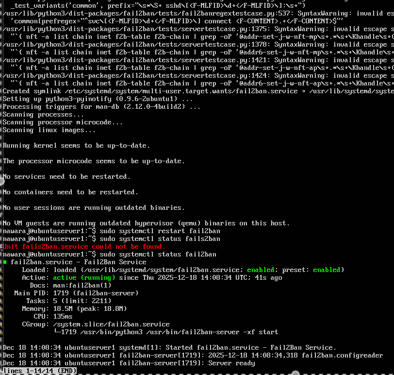

# Week 5 — Advanced Security & Monitoring

**[← Week 4](week4.md)** | **Week 5** | **[Week 6 →](week6.md)**

---

## 📋 Overview

This week builds on the foundational security controls implemented in **Week 4** by enabling advanced host-based security mechanisms and introducing automated monitoring and baseline validation scripts.

The focus is on enforcing **Mandatory Access Control (MAC)**, hardening against brute-force attacks, ensuring timely patching, and preparing structured data collection for performance analysis in **Week 6**.

All configuration, validation, and scripting are performed remotely via **SSH**, maintaining a headless and production-like server environment.

---

## 🎯 Objectives

- Enable and enforce Mandatory Access Control (MAC)
- Configure automatic security updates
- Deploy and configure `fail2ban` for SSH protection
- Build a security baseline verification script
- Build a monitoring script for performance data collection

---

## 📦 Deliverables

- MAC enforcement evidence
- Automatic update configuration and logs
- `fail2ban` configuration and status output
- Security baseline script output
- Monitoring script design and execution evidence

---

## 🛡️ Mandatory Access Control (MAC)

### MAC Selection

**AppArmor** is used due to its native Ubuntu integration and profile-based enforcement model.

### AppArmor Status Verification

```bash
sudo aa-status
````

📸 **Screenshot**


**Figure W5-1:** AppArmor enabled with profiles loaded in enforce mode.

**Verification confirms:**

* AppArmor service is active
* Security profiles are enforced
* Service-level confinement is enabled

---

## 🔄 Automatic Security Updates

### Configuration

```bash
sudo apt update
sudo apt install -y unattended-upgrades
```

Configuration verified in:

```text
/etc/apt/apt.conf.d/50unattended-upgrades
```

**Key settings applied:**

* Security updates enabled
* Non-security updates disabled

📸 **Screenshot**


**Figure W5-2:** unattended-upgrades configured for automatic security patching.

### Log Verification

```bash
journalctl -u unattended-upgrades
```

Logs confirm that automated updates are functioning correctly.

---

## 🚫 Intrusion Prevention with fail2ban

### Installation and Configuration

```bash
sudo apt install -y fail2ban
```

Local jail configuration:

```bash
sudo nano /etc/fail2ban/jail.local
```

Example SSH jail:

```ini
[sshd]
enabled  = true
port     = ssh
maxretry = 5
bantime  = 1h
findtime = 10m
```

### fail2ban Status Verification

```bash
sudo fail2ban-client status
sudo fail2ban-client status sshd
```

📸 **Screenshot**



**Figure W5-3:** fail2ban running with SSH jail active and monitoring authentication attempts.

---

## 🧪 Security Baseline Verification Script

**Script:** `Scripts/security-baseline.sh`

This script validates the server’s security posture against a defined baseline.

### Checks Performed

* SSH configuration (root login and password authentication)
* Firewall status and UFW rules
* AppArmor enforcement
* Automatic update service
* fail2ban service and jail status
* User and sudo configuration

The script outputs a clear compliance summary suitable for audits and repeat validation.

---

## 📈 Monitoring Script for Performance Data

**Script:** `Scripts/monitor-server.sh`

This script collects performance metrics and stores them in structured CSV format.

### Metrics Collected

* CPU usage
* Memory usage
* Disk I/O
* Network activity
* Load averages

### Design Features

* Timestamped output
* Configurable sampling interval
* Low system overhead

Collected data will be analysed in **Week 6**.

---

## 📸 Evidence Collected

* AppArmor enforcement status
* unattended-upgrades configuration
* fail2ban SSH jail status
* Script execution via SSH
* Structured monitoring output files

---

## 💭 Reflection (Week 5)

### Adjustments Made

* fail2ban and firewall rules tuned to allow trusted workstation IPs
* AppArmor profiles reviewed to prevent service disruption

### Performance Impact

* AppArmor introduced negligible overhead
* Automatic updates scheduled safely
* Monitoring scripts designed for minimal resource usage

### Preparation for Week 6

* Sampling intervals finalised
* Data storage structure validated
* Scripts tested under idle and load conditions

---

## ✅ Week 5 Summary

* 🛡️ Mandatory Access Control enforced with AppArmor
* 🔄 Automatic security updates enabled
* 🚫 Brute-force protection implemented using fail2ban
* 🧪 Security baseline verification scripted
* 📈 Monitoring framework prepared for performance analysis

---

**[← Week 4](week4.md)** | **Week 5** | **[Week 6 →](week6.md)**
