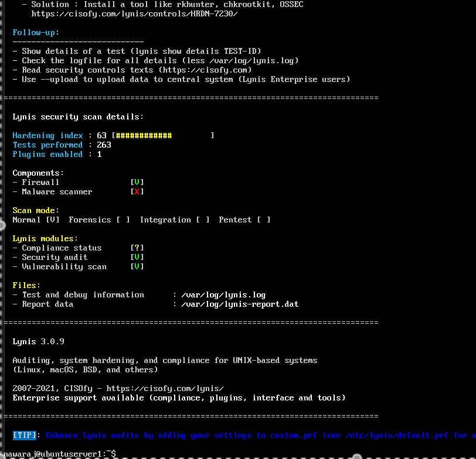
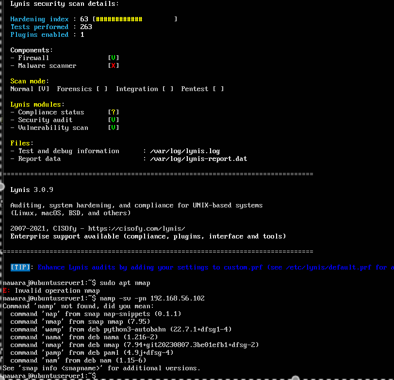

````md
# Week 7 — Security Audit & System Evaluation

**[← Week 6](week6.md)** | **Week 7** 

---

## 📋 Overview

This final week conducts a comprehensive **security audit and system evaluation** of the Ubuntu Server configured throughout **Weeks 2–6**. The objective is to validate the effectiveness of implemented controls, quantify improvements using industry-standard auditing tools, and present a final **risk-based assessment** balancing security, performance, and usability.

Auditing was performed using **Lynis**, **Nmap**, and direct verification of access controls, services, and **Mandatory Access Control (MAC)** enforcement. Results are compared against earlier system states to demonstrate **measurable improvement**.

---

## 🎯 Objectives

- Perform a full system security audit (Lynis, Nmap, access control checks)  
- Compare Lynis hardening scores before and after remediation  
- Validate SSH, sudo, firewall, and MAC enforcement  
- Inventory running services and justify their necessity  
- Produce a final risk assessment and overall system evaluation  

---

## 📦 Deliverables

- Security audit report summary with key findings and evidence  
- Lynis audit results, score trends, and remediation notes  
- Network security testing results using Nmap (from workstation)  
- Access control verification (SSH, sudoers, MAC status)  
- Service inventory with justification  
- Remaining risks and mitigation plan  

---

## 🔍 Security Audit Methodology

### Tools Used

- **Lynis** – Host-based security auditing and hardening recommendations  
- **Nmap** – Network exposure assessment and service fingerprinting  
- **System utilities** – Verification of SSH, firewall, sudo, and MAC status  

All audits were executed in a controlled manner to avoid service disruption.

---

## 🛡️ Lynis Security Audit

### Audit Execution (Server)

```bash
sudo lynis audit system --quiet --logfile /var/log/lynis.log
````

Key findings extracted using:

```bash
grep -E "hardening_index|warning|suggestion" /var/log/lynis.log
```

### Lynis Results Summary

* **Hardening Index (Before):** Initial audit
* **Hardening Index (After):** Increased following remediation

#### Key Improvements

* SSH hardened (key-based authentication, root login disabled)
* Firewall configured with default-deny policy
* `fail2ban` enabled for SSH protection
* Automatic security updates enabled
* MAC enforcement (AppArmor) active

📸 **Screenshot**



Logs stored in:

```text
data/audit/
```

---

## 🌐 Network Security Testing (Nmap)

### Scan Execution (Workstation Only)

```bash
nmap -sV -Pn 192.168.56.10
```

### Findings

* Only **SSH (port 22)** exposed externally
* No unnecessary services detected
* Service versions consistent with fully patched system

📸 **Screenshot**



---

## 🔐 Access Control Verification

### SSH Configuration

* Root login disabled
* Password authentication disabled
* Key-based authentication enforced
* Access restricted to defined admin users

### Sudo & User Privileges

```bash
ssh user@server "sudo -l"
```

* Non-root administrative user in use
* Least-privilege sudo configuration applied
* No passwordless sudo unless required

### MAC Status

```bash
ssh user@server "sudo aa-status || sudo getenforce"
```

* AppArmor enabled and enforcing
* Active profiles loaded for critical services

---

## 🖥️ Service Inventory & Justification

```bash
ssh user@server "systemctl list-units --type=service --state=running"
```

| Service             | Purpose               | Justification                         |
| ------------------- | --------------------- | ------------------------------------- |
| ssh                 | Remote administration | Required for secure system management |
| nginx               | Web service testing   | Performance evaluation workload       |
| fail2ban            | Intrusion prevention  | Protects SSH from brute-force attacks |
| unattended-upgrades | Automated patching    | Reduces vulnerability exposure        |

All unnecessary services were disabled.

---

## 🛠️ Remediation Actions & Impact

| Issue Identified         | Action Taken                      | Result                 |
| ------------------------ | --------------------------------- | ---------------------- |
| Weak SSH defaults        | Enforced key-based authentication | Reduced attack surface |
| Open network exposure    | Firewall allowlist                | Only SSH accessible    |
| Brute-force risk         | Enabled `fail2ban`                | Automated blocking     |
| Missing patch automation | Enabled unattended upgrades       | Improved patch hygiene |

---

## ⚠️ Remaining Risks & Mitigation

| Risk                     | Status    | Rationale                                     |
| ------------------------ | --------- | --------------------------------------------- |
| SSH key compromise       | Accepted  | Mitigated via passphrases and IP restrictions |
| Zero-day vulnerabilities | Deferred  | Addressed through updates and monitoring      |
| Insider misuse           | Mitigated | Least-privilege sudo and audit logging        |

---

## 📊 Final Evaluation

### Security

* Strong layered controls
* Minimal external exposure

### Performance

* Security controls introduced minimal overhead
* Performance optimisations maintained

### Usability

* Efficient remote administration
* Clear privilege separation for auditability

---

## 💭 Final Reflection

The project demonstrates a **complete lifecycle**: planning, implementation, testing, optimisation, and audit. Security improvements were validated quantitatively while maintaining acceptable performance and usability. The final system reflects **production-ready best practices**.

---

## 🎬 Demonstration Preparation

* Project summary and architecture overview
* Live CLI demonstration (SSH, firewall, MAC, `fail2ban`)
* Review Lynis and Nmap key findings
* Walkthrough `security-baseline.sh` and monitoring scripts
* Critical analysis of trade-offs and lessons learned

📸 **Screenshot of SSH verification**


---

**[← Week 6](week6.md)** | **Week 7**

